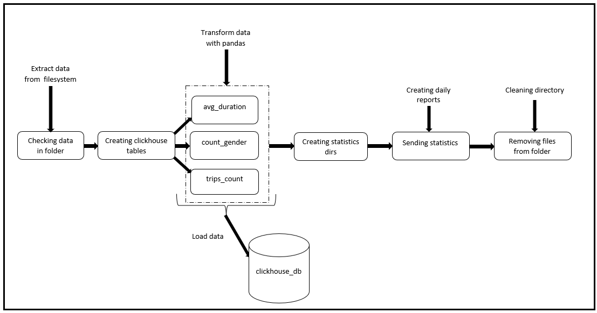

# Нетология. Дипломное задание по программе "Архитектор-разработчик DWH".
Apache airflow пайплайн выгрузки ежедневных отчётов по количеству поездок на велосипедах в городе Нью-Йорк.

**Рекомендации**

1. Отслеживание появление новых файлов в своём бакете на AWS S3. Представим, что пользователь или провайдер данных будет загружать новые исторические данные по поездкам в Ваш бакет;
2. При появлении нового файла запускается оператор импорта данных в созданную таблицу базы данных Clickhouse;
3. Необходимо сформировать таблицы с ежедневными отчётами по следующим критериям:
* количество поездок в день;
* средняя продолжительность поездок в день;
* распределение поездок пользователей, разбитых по категории «gender».
4. Данные статистики необходимо загрузить на специальный S3 бакет с хранящимися отчётами по загруженным файлам.

P.S. Так как получить доступ к AWS S3 не представляется возможным, было принято решение реализовать проект с использованием простой файловой системы. 

**1 шаг**

Запуск контейнера с базой данной `clickhouse`:

https://hub.docker.com/r/yandex/clickhouse-server
- docker run -d --name clickhouse-airflow -p 8123:8123 --ulimit nofile=262144:262144 yandex/clickhouse-server

**2 шаг**

Запуск контейнера с airflow:

1. curl -LfO 'https://airflow.apache.org/docs/apache-airflow/2.4.0/docker-compose.yaml';
2. Была проблема с правами доступа в связи с чем не создавались логи при запуске на Windows 10. Решилась созданием файла `.env`. Внутри файла необоходимо самостоятельно прописать: `AIRFLOW_UID=50000`;
3. Необходимые библиотеки добавляются в переменную `_PIP_ADDITIONAL_REQUIREMENTS`;
4. Был удален `airflow-triggerer`, так как непонятно почему из-за него не поднимался webserver;
5. Инициализация базы данных: docker-compose up airflow-init
Логи и пароль по умолчанию одинаковые: `airflow`;
6. Теперь можно запускать все сервисы командой: docker-compose up.

**Работа ДАГА**

